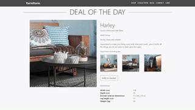

# [FSI QuickZoom](https://www.neptunelabs.com) &middot; Samples
| ***Pixel-perfect*** | ***High-DPI-ready*** | ***Fast :rocket:*** | ***Hackable*** | ***Consistent*** |
|:-----------------:|:-------------:|:---------------:|:---------------:|:---------------:|

[][License]


FSI QuickZoom is an HTML5 and Javascript based tool adding image zoom to desktop and mobile browser.
When hovering over a single source image provided by FSI Server, the part of the image the cursor is currently pointing at will be displayed enlarged in a zoom window next to the original image.
The real-time scaling capabilities of the image server are used to achieve pixel-perfect results.
FSI QuickZoom can be created and controlled as a simple HTML tag and/or via JavaScript API.

This repository contains examples on how to use and build your own applications.



## Getting Started

Without starting this project in your IDE, you can discover all the
demos on the [GitHub Pages][GHPages] or develop and customise in [StackBlitz][Stackblitz].


## Start and develop

To run and modify this samples:

#### NPM

```shell
npm install
npm start
```
or

#### Yarn

```shell
yarn
yarn start
```

Now you can customize the demo according to your own preferences or develop something new.

You can find a very simple example to start with in the ``samples/starter`` folder.

## How it works

These examples rely on a framework that uses [Grunt][Grunt], [Browsersync][Browsersync],
[Bootstrap][Bootstrap] and Sass to launch a local server,
replace template variables and pass changes directly to the browser window.

However, these dependencies are generally **not required** for the using images with FSI
Server!

## Requirements with own images

The images are loaded from an image server (FSI server) in dynamic resolution.
In addition, depending on the sample, static assets such as JavaScript, CSS or static images may also be required.
In this demo, images and static assets are loaded from an example server.
For your **own images** with these examples in this repository,
a separate image server instance is required.

To do this quickly, you can use an [evaluation copy][Server] for an unlimited period
of time.

The recommended way to quickly start your own instance via Docker is described
in this [repository][FSIDockerRepo].

If you have your own server, copy ``env.yml.dist`` to ``env.yml`` and change the settings
according to your FSI server URL.


## Documentation

For further information on the FSI Viewer and FSI Server,
please refer to the official [documentation][Docs].

[License]: https://github.com/neptunelabs/fsi-quickzoom-samples/blob/main/LICENSE

[Docs]: https://docs.neptunelabs.com/fsi-viewer/latest/fsi-quickzoom

[Server]: https://www.neptunelabs.com/get/

[FSIDockerRepo]: https://github.com/neptunelabs/fsi-server-docker-v22

[Grunt]: https://gruntjs.com/

[Browsersync]: https://browsersync.io/

[Bootstrap]: https://getbootstrap.com/

[GHPages]: https://neptunelabs.github.io/fsi-quickzoom-samples/

[Stackblitz]: https://stackblitz.com/edit/fsi-quickzoom-samples
