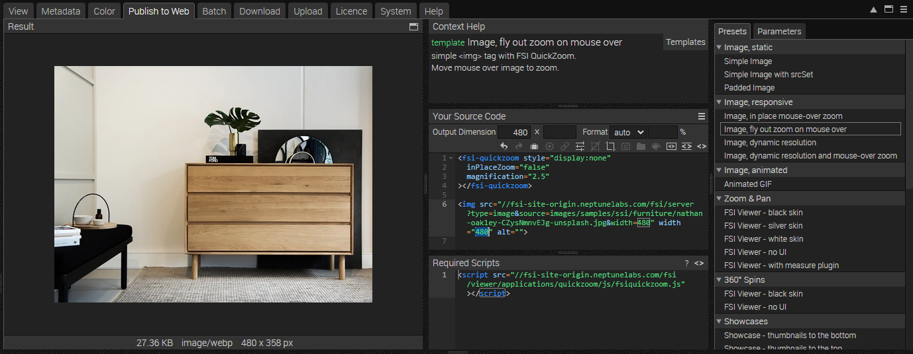

# Product Detail Page - Using Flyout Zoom

This readme describes how the product detail page sample with *Flyout Zoom* with *FSI QuickZoom* is achieved.
The aim of the demo is to show how you can easily integrate zoom by just adding a custom tag.

# Add your images/ assets to FSI Server

First, you'll need to upload the images you want to use to FSI Server.
You can install a [demo version](https://www.neptunelabs.com/get/) via Docker or use our [online demo server](https://demo.fsi-server.com/fsi/interface/) to try it out first.

# Uploading images

There are several possibilities to upload images into the interface.


- Choose the Upload tab, click the "Choose files" button to add files to upload to the list. The files will be uploaded to the current folder.
- Drag & Drop files to the file view or the tree view

# Set zoom in the Web Interface

While having an image or folder selected, you can see all possible publishing ways for the specific item by visiting the "Publish To Web" tab.
For this example, select one image and use the preset *Image, fly out zoom on mouse over* in the section *Image, responsive* :



This publishes the image with a simple  tag and the custom <fsi-quickzoom> tag. Requires a single high resolution image.
If you move the mouse over the image, the image is zoomed in a window next to the image container.

The *Source Code* section enables you to control the look of your image by setting the dimensions and format, as well as adding effects or crop options to it.

You can set the output dimensions and format (auto automatically chooses the best format for the browser used, or you can set WEBP, JPEG, PNG or GIF).
In this area you also can see the source code for your selected publishing option which you can edit and copy to publish the images.

Here you also see the <fsi-quickzoom> tag which sets the parameters used for the zoom option.
If you click on the tag, the bar on the right automatically switches to the tab *Parameters*, enabling you to customize the QuickZoom to your liking.


For our example, it's important to set the parameter **inPlaceZoom** to *false* (which is automatically done by selecting the corresponding preset, but it is important not to change it if you want to recreate the sample.)


For all parameters which can be used, please consult the [manual](https://docs.neptunelabs.com/fsi-viewer/latest/fsi-quickzoom).


# Adding images & zoom to the website

In order to display zoom with FSI QuickZoom, you only need to add the corresponding script you see in the **Required Scripts** section to the head of your website:

```html
<script
  src='https://docs.neptunelabs.com/fsi/viewer/applications/quickzoom/js/fsiquickzoom.js'
</script>
```
This ensures that FSI QuickZoom is loaded.

Place the <fsi-quickzoom> tag part on the start of your body section. In your example, the tag will look like this:
```html
<fsi-quickzoom style="display:none"
               inPlaceZoom="false"
               magnification="2.5"
               enableByCSSClass="zoom"
               zoomImageOffset="20"
               autoZoomDimension="true"
               unCropZoomedImage="true"
></fsi-quickzoom>
```

As aforementioned, inPlaceZoom needs to be set to false in order to achieve the flyout zoom.
**zoomImageOffset** defines the offset between the image container and the zoom window.

You can then add the image to your site by copying the content of the source code:

```html
 
```

## Enabling/ Disabling zoom by CSS class

Naturally, not all images on a site need to be displayed with zoom. In our Product Detail Page example, we only want to display the main product image with the zoom, the thumbnail images on the right or the recommended products on the bottom are not supposed to be zoomed.

We can achieve this by adding a CSS class to the image we want to zoom, **class="zoom"** and by setting the parameter **enableByCSSClass="zoom"** in the <fsi-quickzoom> tag.

If you only need to disable a few images on a site from zooming, you can also use this the other way around by setting the parameter **disableByCSSClass**.

## Testing with examples from  your own server

To test the examples with images from your own [FSI Server](https://www.neptunelabs.com/fsi-server/), please first copy the env.yml.dist file to env.yml and adapt the file, then restart the main demo again.
